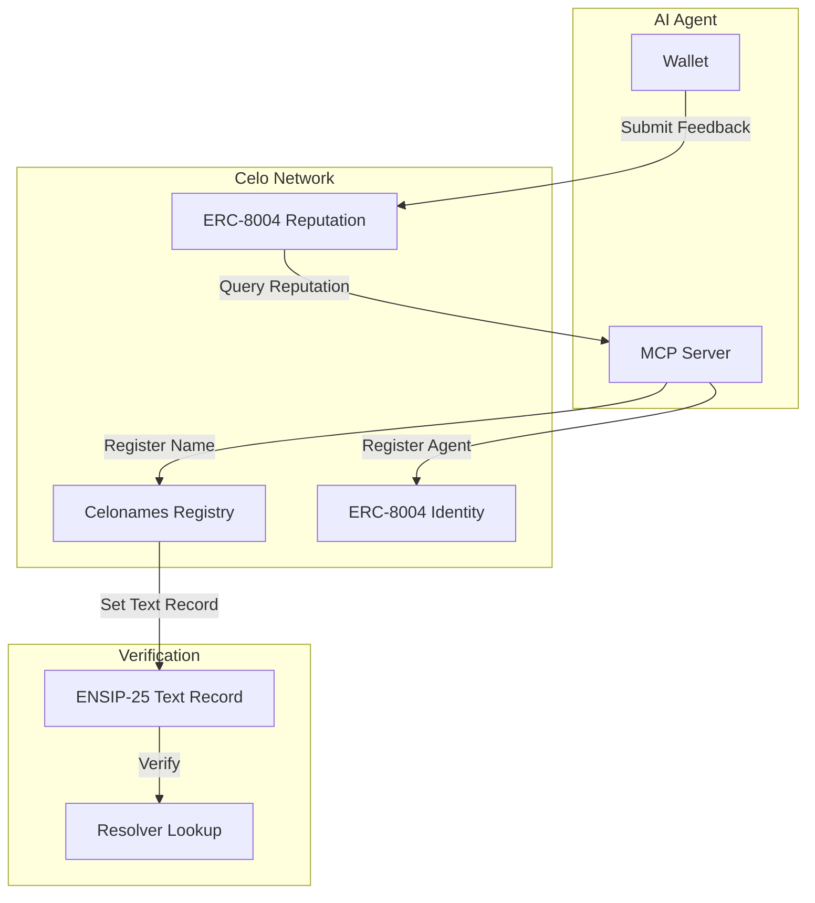

> ## Documentation Index
> Fetch the complete documentation index at: https://celonames.mintlify.app/llms.txt
> Use this file to discover all available pages before exploring further.

# AI Agents with ENSIP-25 & ERC-8004

> Build AI agents on Celo using Celonames, ENSIP-25 verification, and ERC-8004 trust infrastructure

This guide explains how to build AI agents on Celo that use Celonames for human-readable identity, ENSIP-25 for agent verification, and ERC-8004 for trust infrastructure.

## Overview

As AI agents become active participants in on-chain systems, they need:

* **Human-readable identity** → Celonames (ENS on Celo)
* **Verifiable agent ownership** → ENSIP-25 standard
* **Trust and reputation** → ERC-8004 registry

Celonames brings ENS to Celo, enabling AI agents to have portable, readable identities that work across wallets, apps, and protocols. Combined with ENSIP-25 and ERC-8004, you can build autonomous agents that are discoverable, verifiable, and trustworthy.

## Key Concepts

### ENSIP-25: Agent Verification

[ENSIP-25](https://ens.domains/blog/post/ensip-25) is a standard that links an AI agent's on-chain registry entry to an ENS name through a standardized text record format.

**How it works:**

1. An AI agent registers in a registry (like ERC-8004) and claims a Celoname
2. The Celoname owner sets a text record in the format: `agent-registration[<registry>][<agentId>]`
3. If the record is set to `"1"` (or any non-empty value), the association is verified

This enables deterministic verification without new contracts or resolver upgrades.

**Example text record key:**

```
agent-registration[0x049d90010001148004a169fb4a3325136eb29fa0ceb6d2e539a432][42]
```

Breaking this down:

* `0x049d9001000114` - ERC-7930 interoperable address prefix for Celo mainnet
* `8004a169fb4a3325136eb29fa0ceb6d2e539a432` - ERC-8004 Identity Registry address on Celo
* `42` - The agent's unique ID in the registry

### ERC-8004: Agent Trust Infrastructure

[ERC-8004](https://docs.celo.org/build-on-celo/build-with-ai/8004) is an Ethereum standard that establishes trust infrastructure for autonomous AI agents through three registries:

| Registry                | Purpose                                          |
| ----------------------- | ------------------------------------------------ |
| **Identity Registry**   | Portable agent identifiers as ERC-721 NFTs       |
| **Reputation Registry** | Feedback and rating system for agents            |
| **Validation Registry** | Third-party verification hooks (TEE, zkML, etc.) |

### Celo Deployments

| Contract            | Celo Mainnet Address                         |
| ------------------- | -------------------------------------------- |
| Identity Registry   | `0x8004A169FB4a3325136EB29fA0ceB6D2e539a432` |
| Reputation Registry | `0x8004BAa17C55a88189AE136b182e5fdA19dE9b63` |

| Contract            | Celo Sepolia Address                         |
| ------------------- | -------------------------------------------- |
| Identity Registry   | `0x8004A818BFB912233c491871b3d84c89A494BD9e` |
| Reputation Registry | `0x8004B663056A597Dffe9eCcC1965A193B7388713` |

## Building an AI Agent with Celonames

### Step 1: Register a Celoname for Your Agent

Your AI agent should have a human-readable identity. Register a `.celo` name through:

1. **Celonames App**: [https://names.celo.org](https://names.celo.org)
2. **Programmatic registration** via the L2Registrar contracts

### Step 2: Register in ERC-8004 Identity Registry

Create a registration file describing your agent:

```json  theme={null}
{
  "type": "Agent",
  "name": "My Celo AI Agent",
  "description": "An AI agent that performs tasks on Celo",
  "image": "ipfs://Qm...",
  "endpoints": [
    {
      "type": "a2a",
      "url": "https://api.example.com/.well-known/agent.json"
    },
    {
      "type": "mcp",
      "url": "https://api.example.com/mcp"
    },
    {
      "type": "wallet",
      "address": "0x...",
      "chainId": 42220
    }
  ],
  "ens": "myagent.celo",
  "supportedTrust": ["reputation", "validation"]
}
```

Upload this file to IPFS and register your agent:

```typescript  theme={null}
import { IdentityRegistry } from '@chaoschain/sdk';

const registry = new IdentityRegistry(provider, 'celo');

// Upload registration file to IPFS first
const agentURI = 'ipfs://QmYourRegistrationFile';

// Register and get agent ID
const tx = await registry.register(agentURI);
const agentId = tx.events.Transfer.returnValues.tokenId;

console.log('Agent registered with ID:', agentId);
```

### Step 3: Set ENSIP-25 Text Record

Link your agent to your Celoname by setting the verification text record:

```typescript  theme={null}
import { setTextRecord } from '@ensdomains/ensjs';

// Format the registry address according to ERC-7930
const chainId = 42220; // Celo mainnet
const registryAddress = '0x8004A169FB4a3325136EB29fA0ceB6D2e539a432';
const agentId = '42'; // Your agent's ID

// Create the interoperable address format
const erc7930Address = `0x${chainId.toString(16).padStart(4, '0')}9001000114${registryAddress.slice(2)}`;

// Construct the text record key
const textKey = `agent-registration[${erc7930Address}][${agentId}]`;

// Set the text record on your Celoname
await setTextRecord(wallet, {
  name: 'myagent.celo',
  key: textKey,
  value: '1', // Non-empty value confirms the association
});
```

### Step 4: Verify the Association

To verify an agent's Celoname:

```typescript  theme={null}
import { getTextRecord } from '@ensdomains/ensjs';

async function verifyAgent(name: string, registryAddress: string, agentId: string): Promise<boolean> {
  const chainId = 42220;
  const erc7930Address = `0x${chainId.toString(16).padStart(4, '0')}9001000114${registryAddress.slice(2)}`;
  const textKey = `agent-registration[${erc7930Address}][${agentId}]`;
  
  const record = await getTextRecord({
    name,
    key: textKey,
  });
  
  // If record exists and is non-empty, association is verified
  return record && record.value && record.value.length > 0;
}

// Usage
const isVerified = await verifyAgent(
  'myagent.celo',
  '0x8004A169FB4a3325136EB29fA0ceB6D2e539a432',
  '42'
);

console.log('Agent verified:', isVerified);
```

## Example: ENS Registration Agent for Celo

Here's an example of an AI agent that can register Celonames, modeled after the [ENS Registration Agent](https://github.com/schmidsi/ens-registration-agent):

### MCP Server Tools

```typescript  theme={null}
// tools/checkAvailability.ts
export async function checkCeloNameAvailability(name: string): Promise<{
  name: string;
  available: boolean;
}> {
  const normalizedName = name.endsWith('.celo') ? name : `${name}.celo`;
  
  // Query the L2 Registry
  const node = namehash(normalizedName);
  const owner = await l2Registry.owner(node);
  
  return {
    name: normalizedName,
    available: owner === ethers.constants.AddressZero,
  };
}

// tools/getRegistrationPrice.ts
export async function getRegistrationPrice(
  name: string,
  years: number = 1
): Promise<{
  name: string;
  years: number;
  baseWei: string;
  totalWei: string;
  totalEth: string;
}> {
  const normalizedName = name.replace('.celo', '');
  const duration = years * 365 * 24 * 60 * 60; // seconds
  
  const [price] = await l2Registrar.registerPrice(normalizedName, duration);
  
  return {
    name: `${normalizedName}.celo`,
    years,
    baseWei: price.toString(),
    totalWei: price.toString(),
    totalEth: ethers.utils.formatEther(price),
  };
}

// tools/registerName.ts
export async function registerCeloName(
  name: string,
  years: number,
  owner: string
): Promise<{
  success: boolean;
  name: string;
  owner: string;
  commitTxHash: string;
  registerTxHash: string;
}> {
  const normalizedName = name.replace('.celo', '');
  const duration = years * 365 * 24 * 60 * 60;
  
  // Generate commitment
  const secret = ethers.utils.randomBytes(32);
  const commitment = await l2Registrar.makeCommitment(
    normalizedName,
    owner,
    duration,
    secret,
    await l2Registrar.resolver(),
    [],
    false,
    0
  );
  
  // Commit
  const commitTx = await l2Registrar.commit(commitment);
  const commitReceipt = await commitTx.wait();
  
  // Wait for min commitment age (usually 60 seconds)
  await new Promise(r => setTimeout(r, 60000));
  
  // Register
  const [price] = await l2Registrar.registerPrice(normalizedName, duration);
  const registerTx = await l2Registrar.register(
    normalizedName,
    owner,
    duration,
    secret,
    await l2Registrar.resolver(),
    [],
    false,
    0,
    { value: price }
  );
  
  const registerReceipt = await registerTx.wait();
  
  return {
    success: true,
    name: `${normalizedName}.celo`,
    owner,
    commitTxHash: commitReceipt.transactionHash,
    registerTxHash: registerReceipt.transactionHash,
  };
}
```

### Agent Registration File

```json  theme={null}
{
  "type": "Agent",
  "name": "Celo Names Registration Agent",
  "description": "An AI agent that can check availability and register .celo names on the Celo blockchain",
  "image": "ipfs://Qm...",
  "endpoints": [
    {
      "type": "mcp",
      "url": "https://api.example.com/mcp"
    },
    {
      "type": "wallet",
      "address": "0x...",
      "chainId": 42220
    }
  ],
  "ens": "celoregistrar.celo",
  "supportedTrust": ["reputation", "validation"]
}
```

## Reputation Building

After interactions, agents can receive feedback to build reputation:

```typescript  theme={null}
import { ReputationRegistry } from '@chaoschain/sdk';

const reputation = new ReputationRegistry(provider, 'celo');

// Submit feedback after an interaction
await reputation.giveFeedback(
  agentId,
  95,                    // score (0-100)
  0,                     // decimals
  'starred',             // quality category
  '',                    // optional secondary tag
  'https://api.example.com',  // endpoint used
  'ipfs://QmDetailedFeedback',  // detailed feedback URI
  feedbackHash           // keccak256 of feedback content
);

// Query agent reputation before delegating tasks
const summary = await reputation.getSummary(agentId);
console.log('Average rating:', summary.averageScore);
console.log('Total reviews:', summary.totalFeedback);
```

## Integration Flow



## Benefits on Celo

1. **Fee Abstraction**: Register agents and pay gas in stablecoins (cUSD, USDC, USDT)
2. **Fast Finality**: 5-second block times for quick agent interactions
3. **Low Costs**: Inexpensive registrations and transactions
4. **EVM Compatible**: Use existing Ethereum tooling and libraries
5. **Social Connect**: Integrate with Self protocol for identity verification

## References

* [Celo ERC-8004 Documentation](https://docs.celo.org/build-on-celo/build-with-ai/8004)
* [ENSIP-25 Blog Post](https://ens.domains/blog/post/ensip-25)
* [ENS Registration Agent (Reference)](https://github.com/schmidsi/ens-registration-agent)
* [ERC-8004 SDK](https://www.npmjs.com/package/@chaoschain/sdk)
* [ENSjs Documentation](https://github.com/ensdomains/ensjs)

## Next Steps

* Build an MCP server for Celonames registration
* Add your agent to the ERC-8004 registry on Celo
* Set up ENSIP-25 verification for your agent's Celoname
* Integrate x402 payments for agent services
* List your agent in agent directories
